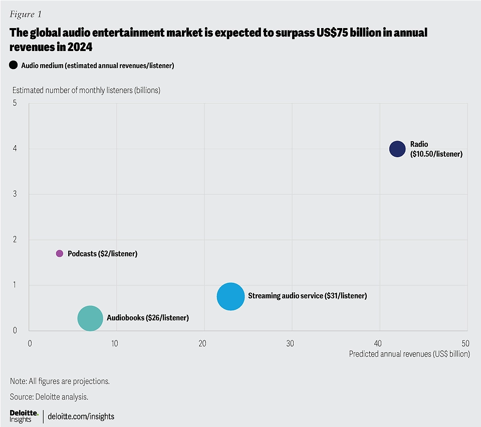
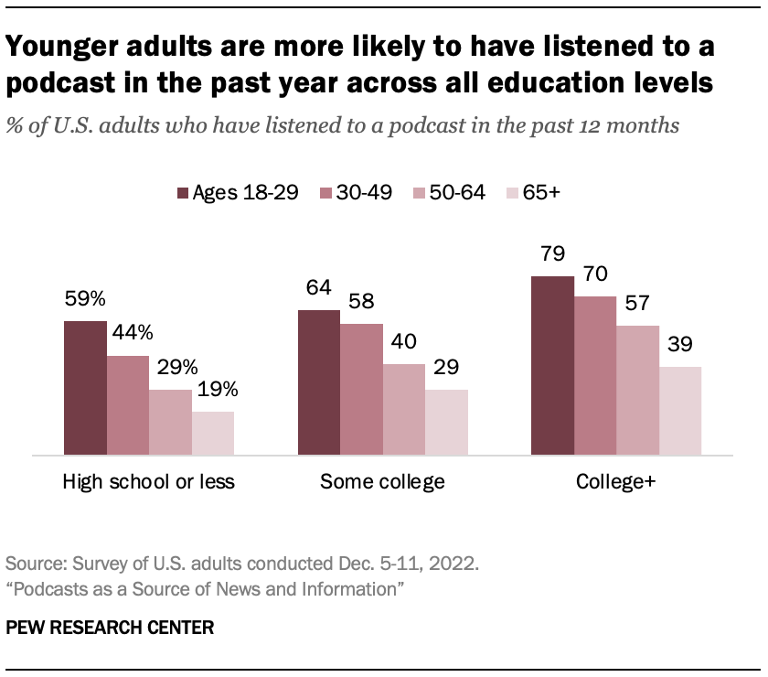

# Research - Secondary - Current podcast usage and behaviors

## 2024 - Edison research
[The infinite dial 2024 report](https://www.edisonresearch.com/the-infinite-dial-2024/#:~:text=)

[Forbes' summary of the report](https://www.forbes.com/sites/bradadgate/2024/04/02/over-100-million-americans-listen-to-a-podcast-each-week/)

1. Growth in podcast reach is driven by large increases among the number of female listeners. Males still listen to more podcasts than females, although the gap is getting smaller. In 2023 there was a seven-point difference (46% vs. 39%) which was reduced to three points this year (48% vs. 45%).
2. 60% of those age 12+ have a traditional AM/FM radio set in their home
3. Podcast listening continues to be highest among younger age groups. In the last month, 59% of 12-34 year-olds had listened to podcasts and 55% of 35-54-year-olds. By comparison, among adults 55+, only 27% had listened to a podcast last month.
4. According to the survey, 100 million Americans now listen to at least one podcast every week, accounting for 34% of Americans aged 12+.

## 2023 - Deloitte
[Shuffle, subscribe, stream: Consumer audio market is expected to amass listeners in 2024, but revenues could remain modest](https://www2.deloitte.com/us/en/insights/industry/technology/technology-media-and-telecom-predictions/2024/consumer-audio-market-trends-predict-more-global-consumers-in-2024.html)

1. Deloitte predicts that more consumers worldwide will engage with audio entertainment overall in 2024—bringing the number of monthly average podcast listeners to over 1.7 billion, monthly average audiobook listeners to 270 million, monthly average streaming music subscribers to 750 million, and monthly average radio listeners to close to 4 billion—or roughly half of the world’s population (figure 1).
2. Annual revenues for these formats are also modestly on the rise for the most part. Adding up estimated annual global revenues for each of these formats—including podcasts (US$3.5 billion), audiobooks (US$7 billion), streaming music (US$23 billion), and radio (US$42 billion)—Deloitte predicts the global audio entertainment market will surpass US$75 billion in revenue in 2024, a total year-over-year increase of around 7% across these four formats.
3. Audio has been surprisingly resilient, both during the pandemic and after. But despite strong reach and listening hours, profit hasn’t always followed suit, which indicates monetization remains an open opportunity across the audio entertainment market.
4. Audio entertainment formats are often overlooked because they are rarely a primary activity. People listen to radio while driving, audiobooks while doing the laundry, podcasts while walking the dog, and streaming music while working. However, being a secondary activity might be audio’s greatest strength.

## 2023 - Pew Research
 [Audio and Podcasting Fact Sheet](https://www.pewresearch.org/journalism/fact-sheet/audio-and-podcasting/)

1. As of 2023, 42% of Americans ages 12 and older have listened to a podcast in the past month, according to “The Infinite Dial” report by Edison Research.

## 2023 - Pew Research
[Podcast use among different age groups](https://www.pewresearch.org/journalism/2023/04/18/podcast-use-among-different-age-groups/)

1. A 2023 Edison Research study reported that while 42% of adults aged 18-34 were monthly podcast listeners, this dropped to 26% for those aged 45-54 and 17% for those 55+. Older adults often gravitate to long-established formats like live radio or TV for content consumption. However, this is shifting:
   1. Health & Wellness Content: Older adults explore podcasts for practical, self-improvement topics.
   2. Integration of Digital Tools: Increased smartphone adoption among older adults is helping them engage with podcasts and other digital-first content.

## 2024 - Vanity Fair
[Joe Rogan and the Fifth Estate: How the Podcaster and a Group of Cable News Exiles Became More Powerful Than Traditional Media](https://variety.com/2024/tv/news/joe-rogan-megyn-kelly-podcasts-shaped-election-1236208937/)

1. "Instead, Trump hit Rogan’s Austin, Texas, studio in the final days of the campaign, racking up a massive audience. “On YouTube alone, … 48 million views,”"
2. Did a motley crew of traditional media defectors and outcasts led by Joe Rogan, Megyn Kelly and Tucker Carlson help tip the scales for Donald Trump’s win over Kamala Harris — and shatter the paradigm of an influential fourth estate in the process?

## 2023 - Slate
[The casualties of the podcasting bloodbath](https://slate.com/business/2023/12/podcasts-layoffs-spotify-heavyweight-stolen-amazon.html)

1. But Spotify’s lurch into podcasting left casualties along the way. Spotify laid off 600 people in January, before its “strategic alignment” in June that claimed 200 podcast-specific roles, in the process consolidating its two studios into one. And just this week, the bloodbath continued: Spotify said on Monday it’s slashing another 1,500 jobs across divisions and ending two popular and critically acclaimed podcasts,
1. “It’s the most desirable demographic in the world,” she says. Podcast listeners “are curious, intellectual, and more likely to take action” based on what they hear.
- flo: some of Pew's research supports this statement

## 2024 - Slate
[Spotify Trapped](https://slate.com/podcasts/what-next-tbd/2024/12/spotifys-algorithm-is-trying)

1. Spotify is shaping listening habits, so much so that musicians are shaping themselves for Spotify. It makes your musical world a little more prescribed, a little smaller. If it feels like everything’s getting a little stale, how do we get out?